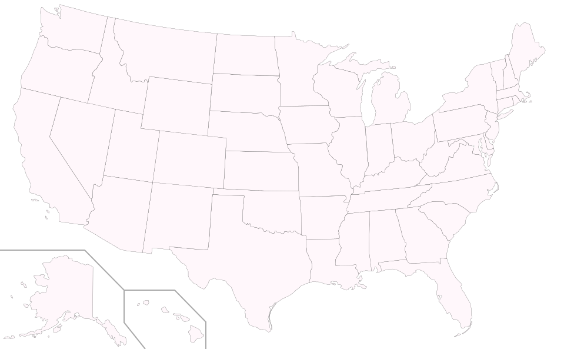
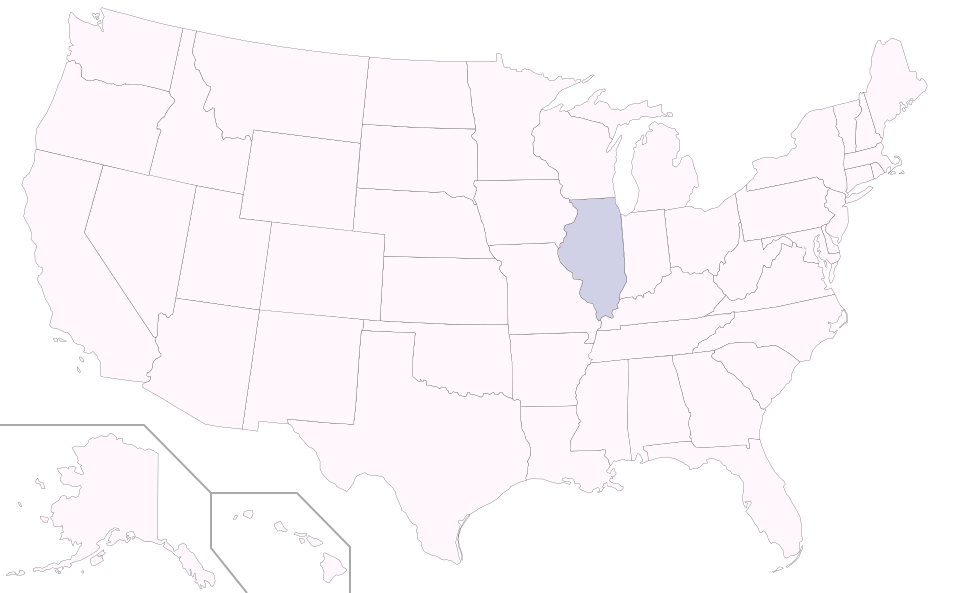
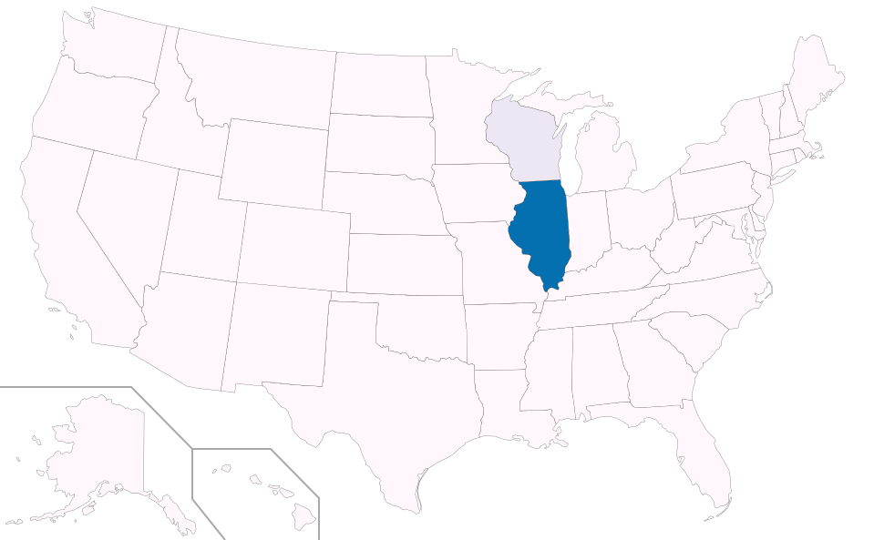

Zombie Simulation
==========

A simple simulation of zombie outbreak, based on the seminal paper, [When Zombies Attack!: Mathematical Modelling of an Outbreak of Zombie Infection](http://mysite.science.uottawa.ca/rsmith43/Zombies.pdf). Created for a special Halloween version of TGG's Lunch & Learn series.

The model adds geography to the basic model outlined in the referenced paper. The logic is as follows: (1) within any given state of the USA, the dynamics follow the basic model and (2) zombies cross state lines at some base rate (due to their roving nature) while the probability of crossing state lines increases with the proportion of the state population that has been zombified (due to their unquenchable appetite for living flesh).

State populations are based on the 2010 Census. Shading indicates zombification of the population. The outbreak begins with a single zombie from Illinois...

# Day 0

# Day 3

# Day 5

